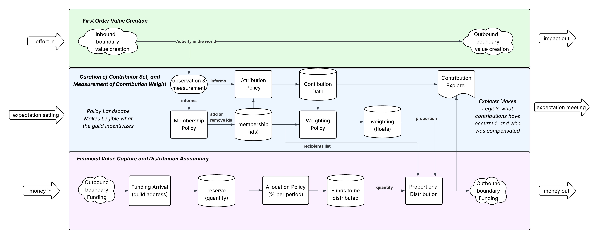

# getguilded

A **Guild** is a flexible, self-governing structure designed to align community-driven productivity with financial sustainability. It does so by maintaining a curated and evolving set of contributors, assigning dynamic weights to their contributions, and distributing incoming funds proportionally — all without unnecessary bureaucracy.

This pattern supports activities where value creation is visible, but the beneficiaries and contributors may be fluid. It offers a structured-yet-flexible way to handle funding, accountability, and recognition.

## Key Concepts

- **Value Creation**: Contributions that improve or maintain shared community resources.
- **Membership Policy**: Defines who qualifies as a contributor.
- **Weighting Policy**: Assigns contribution weights to each member based on observed or assessed value.
- **Financial Distribution**: Distributes funds in proportion to contribution weights over time.

The system can be visualized with this high-level process diagram:

---

## A Story: The Fence Painters Guild of Littleton Square

Imagine the **Fence Painters Guild of Littleton Square**:

- Residents care about keeping their neighborhood fences vibrant and well-maintained.
- A group of volunteers forms the guild — some buy paint, some paint, some organize schedules, and one local artist begins adding murals.
- A membership policy decides who is actively contributing and can join the guild.
- Over time, contributors change. Some leave, others step up, and the artist's murals attract attention and praise.
- The town, seeing cultural and civic value, allocates funding. Private residents may also donate.
- A weighting policy reflects current contributions: painting time, materials bought, artistic innovation, coordination effort, etc.
- Funds are distributed proportionally — a reward for meaningful participation.
- The system is **legible** (clear who contributes), **legitimate** (transparent, peer-assessed), and **lightweight** (minimal overhead).

This model creates an environment where positive externalities — like beauty, upkeep, or cultural richness — are nurtured and sustained through cooperative effort and shared incentives.

---

## Goals of This Repo

This repository will (eventually) contain a simple **Python simulation notebook** of the guild structure, using basic data structures and logic to show how:

- Membership and weights are managed
- Value contributions evolve over time
- Funds are distributed fairly

It’s designed for clarity, not complexity — to help others adopt, adapt, or extend the guild pattern in their own communities, DAOs, or cooperatives. This model is intended to provide an abstact pattern for guilds to further encourage interguild collaboration -- even including guilds as members of other guilds, where appropriate, without breaking the core primitives that underly guilding.
